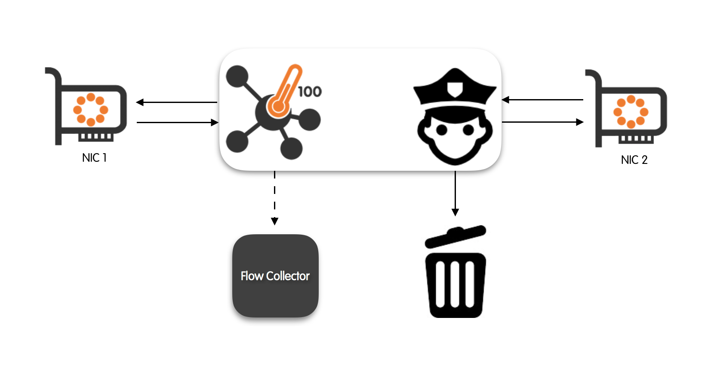

Network Bridge
==============

nProbe™ Cento features (in the cento-bridge binary) a bi-directional bridge mode. When functioning in bridge mode, nProbe™ Cento intercepts, policy, and (possibly) forward any traffic that goes through a pair of network interfaces. Flow export functionalities will continue to work smoothly and independently from the bridge.

nProbe™ Cento allow a fine-grained control of the bridged traffic through a set of hierarchical rules.  Rules are submitted statically using a text file during nProbe™ Cento startup or dynamically via a REST API. nProbe™ Cento can be instructed to re-read the rules text file by sending a SIGHUP to the process (e.g., kill -SIGHUP <process id>). This can be useful for example to update the bridging policies without stopping and restarting the process.

The set of rules available to policy the bridged traffic is similar to the ones used to policy egress queues.

A detailed description of network bridge configuration and policing is given in the remainder of this section. The careful reader will notice a certain degree of overlap with configuration and policing of egress queues. Indeed, in an effort to keep nProbe™ Cento as usable as possible, the developers have designed a clear workflow that can be almost seamlessly used both in the context of packet bridging and in the one of egress queues.

Policing Bridged Traffic
------------------------

Bridged traffic is policed though a fine-grained set of hierarchical rules, in fact rules can be applied at three different levels, namely:

- At the level of bridge;
- At the level of subnet;
- At the level of application protocol.

Application protocol rules take precedence over subnet-level rules which, in turn, take precedence over the bridge-level rules.
Bridge-level rules can be thought of as the "default" bridge rules.

Rule types are mainly two, namely:

- Forward: forward the packet;
- Discard: do not forward the packet;

Forward means the traffic received from a bridged network interface card (NIC) will be forwarded to the other bridged NIC as-is, without being dropped, altered, or modified.
Discard means that the traffic received from a bridged NIC will not get forwarded to the other bridged NIC.

Important: when the default policy is set to discard, traffic is always forwarded until the protocol is detected and the protocol-based rules can be evaluated.
In the same way, when the default policy is set to forward, traffic is always forwarded until the protocol is detected, even for protocols with a discard policy,
as cento requires a few packets to detect it. This behaviour is expected by design.

Rules are expressed as <policed unit> = <policy>. For example, one that wants to bridge all the NICs traffic will use the following expression 

.. code-block:: text

   default = forward

Assuming an exception is needed to waive the default rule in order to drop all the traffic that originates from (is destined to) subnet 10.0.0.0/8, one will use the additional rule

.. code-block:: text

   10.0.0.0/8 = discard

Supposing another exception is needed to waive both the default rule and the rule set on the subnet in order to always drop Viber traffic, one will add a third rule as

.. code-block:: text

   Viber = discard

The full list of DPI protocols supported by can be printed with

.. code-block:: console

   cento --print-ndpi-protocols

The Network Bridge Configuration File
-------------------------------------

Rules are specified in a plain text file that follows the INI standard. INI is a very simple standard that specify the format of the configuration file. For a more detailed introduction on the INI standard, the interested reader is referred to the section “The Egress Queues Configuration File” that follows the same standard.

nProbe™ Cento network bridge configuration files contain, between square brackets, sections corresponding to the different hierarchical levels of rules. Each section contains the rules, one per line, that have to be applied. An exhaustive example of configuration file is the following

.. code-block:: text

   [bridge]
   default = forward
   banned-hosts = discard
   
   [bridge.subnet]
   192.168.2/24 = discard
   
   [bridge.protocol]
   Skype = discard

In the remainder of this section is given a description of configuration file sections. As already anticipated with the configuration file example, network bridging is configured via three sections, namely [bridge], [bridge.subnet] and [bridge.protocol]. Rules are indicated in every section, one per line.

[bridge.protocol]
contains application-protocol forwarding rules that must be enforced. Any application protocol is expressed using a mnemonic string. The full list of application protocols available can be queries simply by running nProbe™ Cento inline help

.. code-block:: console

   cento --print-ndpi-protocols

Any line in this section has the format <protocol name> = <policy>, where policy can be any of: forward and discard. 

An example is

.. code-block:: text

   [bridge.protocol]
   Skype = discard
   Viber = discard

[bridge.subnet] contains forwarding rules that are enforced at the level of subnet. Every line in this section is formatted as <CIDR subnet> = <policy>. Subnets are expressed using the common CIDR <address>/<netmask> notation. Policy can be any of: forward and discard.

An example is

.. code-block:: text

   [bridge.subnet]
   10.0.0.1/32 = discard
   10.10.10/24 = discard

If a flow matches both a subnet- and a protocol-level rule, then the protocol-level rule is applied.

[bridge] contains the “default” bridge policies, that is, any flow that doesn’t match any rule indicated in the subnet and protocol sections, then will be policed using the “default” rules. This section contains at most two lines, one for the default policy and the other for the policy that has to be applied to banned hosts. We refer the reader to the section “Command Line Options” for a detailed description of banned hosts.

An example is

.. code-block:: text

   [bridge]
   default = forward
   banned-hosts = discard

In the example above, all the flows that are not policed via subnet or protocol-level rules are forwarded as specified in the default rule. If an host belongs to the list of banned-hosts, then all the traffic gets discarded.

Note: shunting (shunt section) and slicing (slice-l3 or slice-l4 actions) rules are also supported, however they are not usually required in bridge mode as it does not make sense to use them in real world scenarios. If you are interested in configuring traffic shunt or slice in bridge mode, please refer to the syntax described in the Egress Queues (IDS mode using cento-ids) section.

Configuration Examples
----------------------

Simple Bridge
~~~~~~~~~~~~~

Assuming nProbe™ Cento has to be used to bridge ZC eth1 and eth2 interfaces using configuration file bridge.example and banned hosts list file banned.example, it is possible to use the following command

.. code-block:: console

   cento-bridge -i zc:eth1,zc:eth2 --bridge-conf bridge.example --banned-hosts banned.example --dpi-level 2 -v 4

TX Offload
~~~~~~~~~~

The bridge configuration can be optimized on selected adapters to get the best packet forwarding performance.
Napatech adapters for instance support zero-copy transmission, this means received packets can be forwarded
in hardware, offloading the packet copy. This support should be enabled when configuring the adapter, by using
the ntpl tool, and can be combined with streams to distribute the load to multiple cores.

Please find below a sample "tx-offload.ntpl" script that can be used to configure 2 streams on port 0
and forward traffic to port 1.

.. code-block:: text

   Delete=All
   
   HashMode[Priority = 0; Layer4Type=TCP,UDP,SCTP] = Hash5TupleSorted
   HashMode[Priority = 1; Layer3Type=IP] = Hash2TupleSorted
   
   Setup[NUMANode=0] = StreamId==(0..1)
   Setup[TxDescriptor = DYN1; TxPorts = 1; TxIgnorePos = 141] = StreamId == (0..1)
   
   Assign[StreamId = (0..1); Descriptor = DYN1] = Port == 0

Command to load the NTPL script to the adapter:

.. code-block:: bash

   sudo /opt/napatech3/bin/ntpl -f tx-offload.ntpl

In order to enable TX offload in nProbe Cento, a :code:`--tx-offload` option is available. In the below example
nProbe Cento is configured to spaws 2 capture threads, one per stream, and forward to port 1 all traffic
according to the rules configured in the rules.conf file.

.. code-block:: bash

   cento-bridge -i nt:stream[0-1],nt:1 --tx-offload --dpi-level 2 --bridge-conf rules.conf

Sample rules configuration file for discarding video traffic from selected applications:

.. code-block:: text

   [bridge]
   default = forward
   banned-hosts = discard
   
   [bridge.protocol]
   NetFlix = discard
   YouTube = discard

Flow Forwarding Offload
~~~~~~~~~~~~~~~~~~~~~~~

Traffic processing can be further optimized by offloading flow rules to the adapter, on adapters
featuring an hardware Flow Manager (Napatech). This allows to offload traffic forwarding rules to
forward or discard all packets for a specific flow, dramatically reducing the load on the CPU.
Cento offloads flows to the adapter as soon as the application protocol has been detected (this
requires a few packets for each flow, depending on the actual protocol).

Note: a Flow Manager enabled firmware is required in order to use flow offload on the adapter.

Please find below a sample "flow-offload.ntpl" script that can be used to configure 4 streams to
forward traffic between ports 0 and 1 in both directions. This script is also compatible with TX Offload
(--tx-offload) and can also be used with both Flow Offload and TX Offload enabled at the same time.

.. code-block:: text

   Delete = All
   
   // Pair of uplink and downlink ports
   Define UL_PORT = Macro("0")
   Define DL_PORT = Macro("1")
   
   // Streams / threads
   Define STREAMS = Macro("(0..3)")
   Define NUMA    = Macro("0")
   
   Define TX_FORWARD = Macro("0x00")
   Define TX_DISCARD = Macro("0x08")
   
   Define FLM_HIT       = Macro("0x00")
   Define FLM_MISS      = Macro("0x10")
   Define FLM_UNHANDLED = Macro("0x20")
   
   Define FLM_DISCARD = Macro("3")
   Define FLM_FORWARD = Macro("4")
   
   Define isIPv4    = Macro("Layer3Protocol==IPv4")
   Define isTcpUdp  = Macro("Layer4Protocol==TCP,UDP")
   
   KeyType[Name=KT_4Tuple] = {32, 32, 16, 16}
   
   Define KeyDefProtoSpec = Macro("(Layer3Header[12]/32, Layer3Header[16]/32, Layer4Header[0]/16, Layer4Header[2]/16)")
   KeyDef[Name=KD_4Tuple; KeyType=KT_4Tuple; IpProtocolField=Outer; KeySort=Sorted] = KeyDefProtoSpec
   
   HashMode = Hash5TupleSorted
   
   Setup[NUMANode=NUMA] = StreamId == STREAMS
   
   // Tx port number is the first 3 bits of the NtDyn1Descr_s->color at offset 138 (0b000XXX)
   // Tx forward/discard verdict is bit 4 of the NtDyn1Descr_s->color at offset 141 (0b00X000)
   Setup[TxDescriptor=DYN; TxPorts=UL_PORT,DL_PORT; TxPortPos=138; TxIgnorePos=141] = StreamId==STREAMS
   
   // Set TX port value, which is the first 3 bits of the NtDyn1Descr_s->color
   Assign[ColorMask=DL_PORT; Descriptor=DYN1] = Port==UL_PORT
   Assign[ColorMask=UL_PORT; Descriptor=DYN1] = Port==DL_PORT
   
   // Set TX forward/discard, which is bit 4 of the NtDyn1Descr_s->color
   Assign[ColorMask=TX_FORWARD; Descriptor=DYN1] = Port==UL_PORT,DL_PORT
   
   // New and unhandled flows are sent to the host
   Assign[StreamId=STREAMS; ColorMask=FLM_UNHANDLED; Descriptor=DYN1] = Port==UL_PORT,DL_PORT AND isIPv4 AND isTcpUdp AND Key(KD_4Tuple, KeyID=1) == UNHANDLED
   Assign[StreamId=STREAMS; ColorMask=FLM_MISS;      Descriptor=DYN1] = Port==UL_PORT,DL_PORT AND isIPv4 AND isTcpUdp AND Key(KD_4Tuple, KeyID=1) == MISS
   
   // Drop discarded flows
   Assign[StreamId=DROP] = Port==UL_PORT,DL_PORT AND isIPv4 AND isTcpUdp AND Key(KD_4Tuple, KeyID=1) == FLM_DISCARD
   
   // Forward allowed flows between ports
   Assign[StreamId=Drop; DestinationPort=DL_PORT] = Port==UL_PORT AND isIPv4 AND isTcpUdp AND Key(KD_4Tuple, KeyID=1) == FLM_FORWARD
   Assign[StreamId=Drop; DestinationPort=UL_PORT] = Port==DL_PORT AND isIPv4 AND isTcpUdp AND Key(KD_4Tuple, KeyID=1) == FLM_FORWARD

Note: the above NTPL is similar to the passive capture configuration, expection made for the *ColorMask=TX_FORWARD* assignment.

Command to load the NTPL script to the adapter:

.. code-block:: bash

   sudo /opt/napatech3/bin/ntpl -f flow-offload.ntpl

In order to enable flow offload in nProbe Cento, a :code:`--flow-offload` option is available. In the below example
nProbe Cento is configured to spaws 4 capture threads, one per stream, and forward traffic according to the rules 
configured in the rules.conf file.

.. code-block:: bash

   cento-bridge -i nt:stream[0-3],nt:stream[0-3] --tx-offload --flow-offload --dpi-level 2 --bridge-conf rules.conf

Sample rules.conf file for discarding video traffic from selected applications:

.. code-block:: text

   [bridge]
   default = forward
   banned-hosts = discard
   
   [bridge.protocol]
   NetFlix = discard
   YouTube = discard

The Network Bridge Runtime REST Configuration API
-------------------------------------------------

nProbe™ Cento has been designed to allow the network bridge to be dynamically configured by means of a REST API. 
This API that provides the same level of flexibility that can be achieved through the configuration file.

Please refer to the *API Documentation* section for the full API specification.

Additional Resources
--------------------

Additional configuration examples for Napatech (TX Offload and Flow Offload) are available in the `demo repository from Napatech`_.

.. _demo repository from Napatech: https://github.com/tourko/cento-demo/

