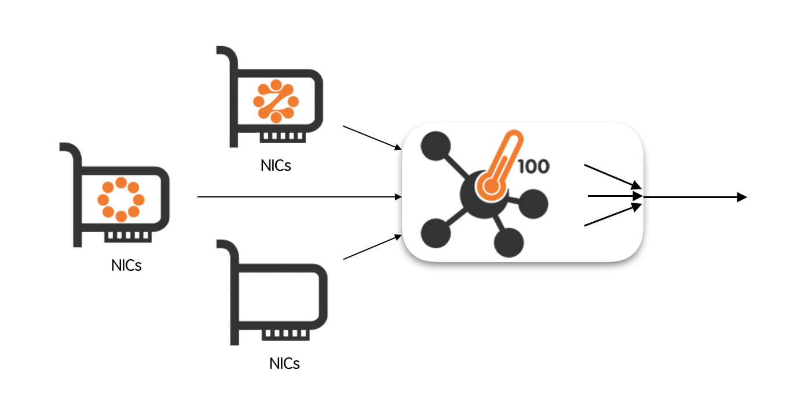
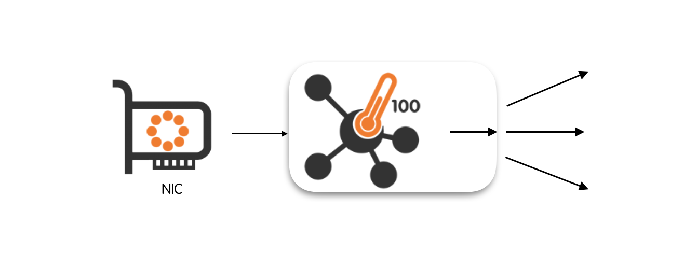
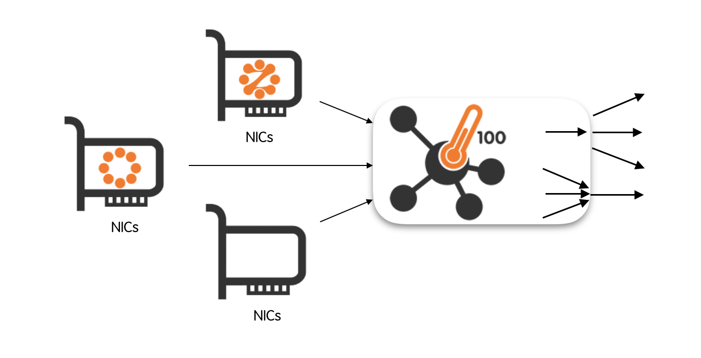
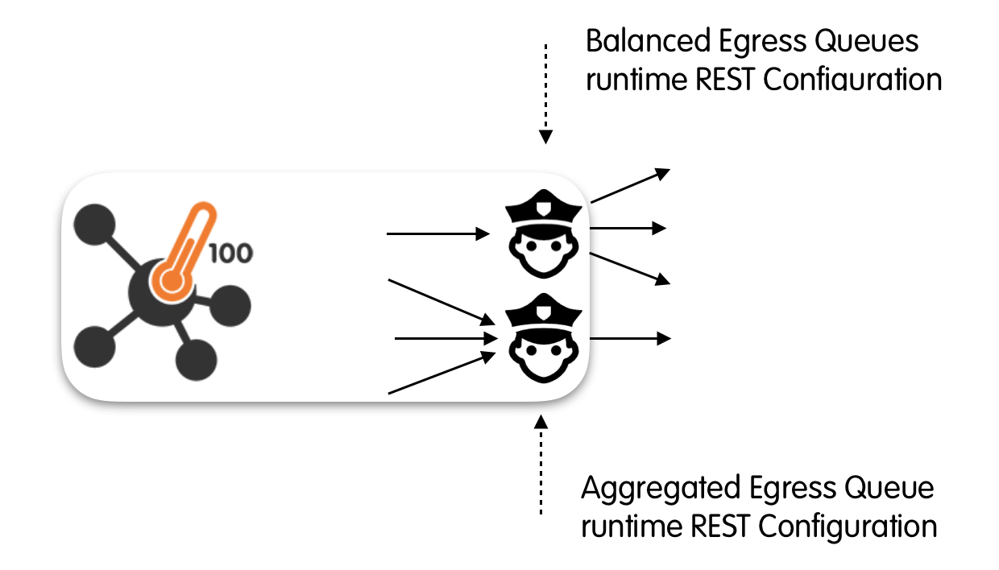

Egress Queues
=============

As it has already been introduced in section “Use Cases”, nProbe™ Cento implements (in the cento-ids binary) traffic forwarding functionalities that allow to:

- Capture packets from multiple input interfaces and forward them towards a single, aggregated egress queue.

- Capture packets from an input interface and forward them towards multiple, balanced egress queues.

- Capture packets from one or more input interfaces and simultaneously forward them to multiple balanced queues and to a single aggregated queue.

An egress queue is said to be aggregated when it carries packets coming from multiple input interfaces. Conversely, it is said to be balanced when it carry a subset of packets originated at the input interface.

Often, a bare packet forwarder doesn’t suffice as one may need some flexibility to policy the traffic that goes through the output queues. For example, if the egress queue used by a packet recorder, one may save valuable space by avoid recording encrypted traffic payloads. Similarly, when the balanced egress queues are sent to IDS/IPS, one may reduce the load on the processors by dropping encrypted packets.

Policing Egress Queues Traffic
------------------------------

Both aggregated and balanced egress queues allow a fine-grained traffic control through a set of hierarchical rules. Rules are submitted using a text file during nProbe™ Cento startup or dynamically via a REST API. nProbe™ Cento can be instructed to re-read the rules text file by sending a SIGHUP to the process (e.g., kill -SIGHUP <process id>). This can be useful for example to update the policies without stopping and restarting the process.

Rules can be applied at three different levels, namely:

- At the level of queue;
- At the level of subnet;
- At the level of application protocol.

Application protocol rules take precedence over subnet-level rules which, in turn, take precedence over the queue-level rules. Queue-level rules can be thought of as the “default” queue rules.

Policy Rules
~~~~~~~~~~~~

As already introduced above, policies can be enforced at three different levels by means of rules. Rule types are five, namely:

- Forward: forward the packet;
- Discard: do not forward the packet;
- Shunt: forward the first K packets in every flow, where K is a configurable constant;
- Slice-l4: cut the packet after the IP layer;
- Slice-l3: cut the packet after the TCP/UDP layer.
- Destination Queue/Interface: forward the packet to a specific queue or egress interface (balanced egress only)

Forward means the traffic should be delivered to the output queue as-is, without being dropped or modified.
Discard means that the traffic doesn’t get forwarded to the output queue.
Shunt means that only the first K packets of every flow are forwarded to the output queue. The value of K is configurable and can be set by the user.
Slice-l4 (slice-l3) mean that the packet is forwarded only up to the layer-4 (layer-3) headers. Any layer-4 (layer-3) payload is discarded.

Rules are expressed as <policed unit> = <policy>. For example, one that wants to shunt all the egress traffic will use the rule 

.. code-block:: text

   default = shunt

Assuming an exception is needed to waive the default rule in order to record all the traffic that originates from (is destined to) subnet 10.0.0.0/8, one will use the additional rule

.. code-block:: text

   10.0.0.0/8 = forward

Supposing another exception is needed to waive both the default rule and the rule set on the subnet in order to always drop SSH traffic, one will add a third rule as

.. code-block:: text

   SSH = discard

If a specific application application protocol should be forwarded to one of the queues or network interfaces configured in a balanced egress configuration (it should be one of the interfaces listed in --balanced-egress-queues), the destination queue index or egress interface can be configured as below

.. code-block:: text

   DNS = eth1

Please note that the list of DPI protocols supported by cento can be printed with:

.. code-block:: console

   cento --print-ndpi-protocols

The Egress Queues Configuration File
------------------------------------

Rules are specified in a plain text file that follows the INI standard. INI is a very simple standard that specify the format of the configuration file. The configuration file is divided in sections. Every section starts with a “label” that is wrapped between square brackets, e.g., [egress.aggregated]. Every line contained after the label is related to the section. A section ends implicitly when a new section begins. 

nProbe™ Cento configuration files contain, between square brackets, sections corresponding to the different hierarchical levels for both aggregated and balanced egress queues. Each section contains the rules that have to be applied. An additional section is present to configure shunting. An exhaustive example of configuration file is the following

.. code-block:: text

   [egress.aggregated]
   default = shunt
   banned-hosts = discard
   
   [egress.aggregated.subnet]
   10.0.0.1/32 = forward
   10.10.10/24 = forward
   
   [egress.aggregated.protocol]
   HTTP = forward
   SSL = slice-l4
   SSH = slice-l4
   
   [egress.balanced]
   default = forward
   banned-hosts = discard
   
   [egress.balanced.subnet]
   192.168.2/24 = discard
   
   [egress.balanced.protocol]
   SSL = discard
   SSH = discard
   DNS = eth1
   
   [shunt]
   default = 10
   tcp = 12
   udp = 2
   HTTP = 40
   SSL = 5

In the remainder of this section is given a description of configuration file sections.

Shunting
~~~~~~~~

The [shunt] section of the configuration file allows you to specify the number of packets for each flow that have to go through any egress queue. 
This section is global and applies both to aggregated and balanced queues. The default number of packets is 10, and it can be modified using the rule:

.. code-block:: text

   default = 10

The rule above sets to 10 the maximum number of packets per flow that are forwarded to the egress queues. Caps can also be set for the maximum number of packets that have to go though any tcp (e.g., tcp = 12) or udp (e.g., udp = 2) flow. Similarly, the maximum number of packets can be configured on a per-application-protocol basis. For example, to set to 40 the maximum number of packets allowed to go through ay HTTP flow, one can use the following line

.. code-block:: text

   HTTP = 40

The rule of last resort is default, that is, any flow that doesn't match any of the other rules is shunted using the default value. Application-protocol rules “override” layer-4 rules, that is, an HTTP flow transported over tcp is forwarded up to the 40th packet if one considers the examples above.

All reserved keywords (in addition to nDPI protocols) are:

- default
- tcp
- udp

Aggregated Egress Queue
~~~~~~~~~~~~~~~~~~~~~~~

Aggregated egress queues are configured via three sections, namely [egress.aggregated], [egress.aggregated.subnet] and [egress.aggregated.protocol]. Rules are indicated in every section, one per line.

[egress.aggregated.protocol]
contains application-protocol forwarding rules that must be enforced. Any application protocol is expressed using a string. The full list of application protocols available can be queries simply by running nProbe™ Cento inline help

.. code-block:: console

   cento --print-ndpi-protocols

Any line in this section has the format <protocol name> = <policy>, where policy can be any of: forward, discard, shunt, slice-l4 and slice-l3. 

An example is

.. code-block:: text

   [egress.aggregated.protocol]
   HTTP = forward
   SSL = slice-l4
   SSH = slice-l4

[egress.aggregated.subnet] contains forwarding rules that are enforced at the level of subnet. Every line in this section is formatted as <CIDR subnet> = <policy>. Subnets are expressed using the common CIDR <address>/<netmask> notation. Policy can be any of: forward, discard, shunt, slice-l4 and slice-l3.

An example is

.. code-block:: text

   [egress.aggregated.subnet]
   10.0.0.1/32 = forward
   10.10.10/24 = forward

If a flow matches both a subnet- and a protocol-level rule, then the protocol-level rule is applied.

[egress.aggregated] contains the “default” egress queue policies, that is, any flow that doesn’t match any rule indicated in the subnet and protocol sections, then will be policed using the “default” rules. This section contains at most two lines, one for the default policy and the other for the policy that has to be applied to banned hosts. We refer the reader to the section “Command Line Options” for a detailed description of banned hosts.

An example is 

.. code-block:: text

   [egress.aggregated]
   default = shunt
   banned-hosts = discard

In the example above, all the flows that are not policed via subnet- or protocol-level rules are shunted as specified in the default rule. If an host belongs to the list of banned-hosts, then all the traffic gets discarded.

Balanced Egress Queues
~~~~~~~~~~~~~~~~~~~~~~

Balanced egress queues are configured exactly as it is described in the section above for aggregated egress queues. The only difference lays in the three section names that are:

.. code-block:: text

   [egress.balanced]

   [egress.balanced.subnet] 

   [egress.balanced.protocol]

Therefore, we refer the reader to the previous section for a detailed description of queues configuration.

The Egress Queues runtime REST Configuration API
------------------------------------------------

nProbe™ Cento has been designed to allow egress queues to be dynamically configured by means of a REST API. One of the main reasons behind the choice of exposing queues configuration though an API is to provide a feedback channel that can be used, for example, by IDS/IPS such as Suricata od Snort. Indeed, it is fundamental to provide IDS/IPS with a quick way to policy the traffic on the basis of their runtime decisions. Thanks to this API, an IDS/IPS becomes able, for example, to block an host that has just been flagged as malicious. Similarly, it can use the API to instruct nProbe™ Cento to start sending the traffic of a suspicious subnet to a traffic recorder. 

This API that provides the same level of flexibility that can be achieved through 
the configuration file. Indeed, the API can be used to set policy rules at any of 
the three different levels thoroughly discussed above, namely, at: the queue-, the 
subnet- and the protocol-level. We refer the interested reader to the “Policy Rules” 
section above for a detailed description of these rules.

Please refer to the *API Documentation* section for the full API specification.

