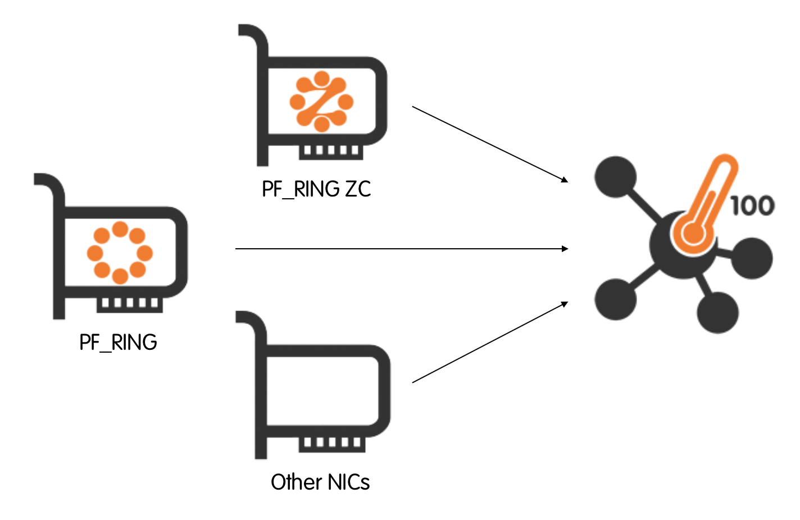
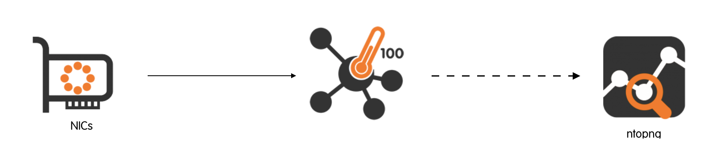
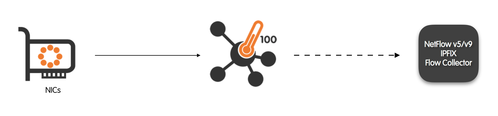
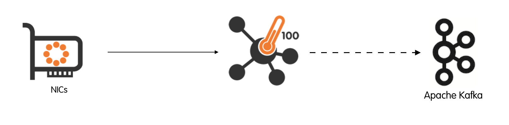
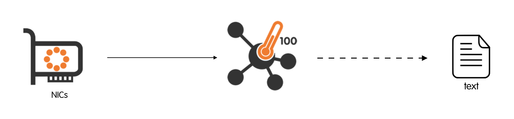
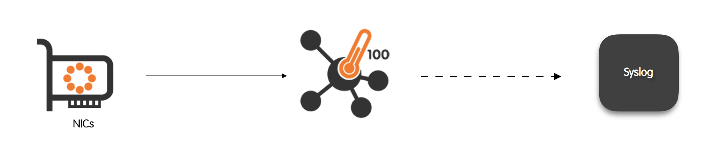
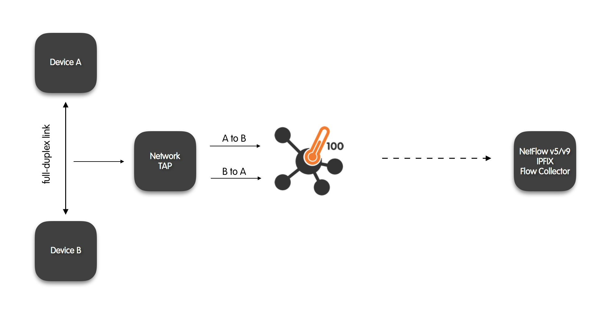
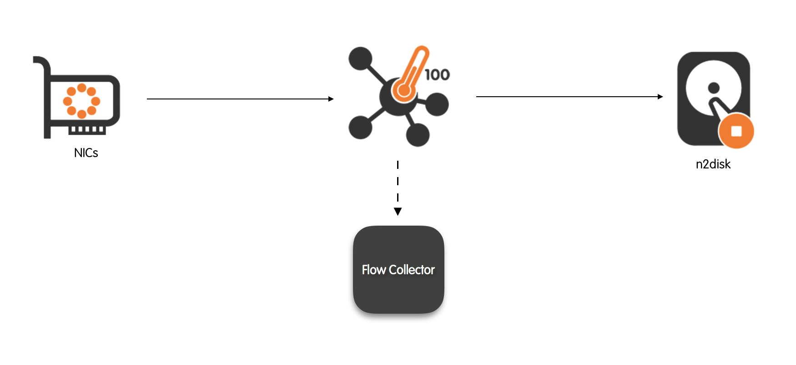
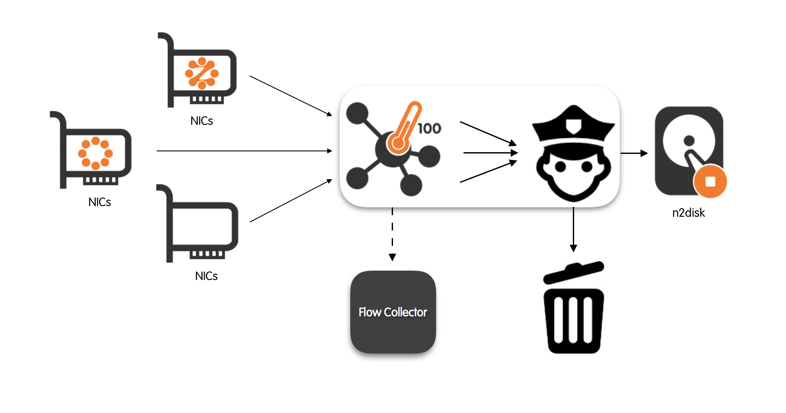
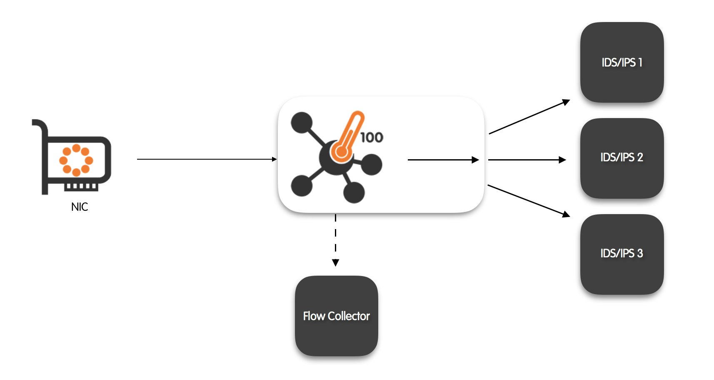

Use Cases
=========

In this section is listed a comprehensive, yet not exhaustive, set of nProbe™ Cento use cases. Use cases range from quick network flow export to more sophisticated integrations with traffic recorders and intrusion detection / intrusion prevention systems (IDS/IPS). The great flexibility of nProbe™ Cento will be able to effectively provide solutions to:

- Quickly convert network packets into flows that can be stored, analysed or exported to custom or third-party software. For example, flows can be sent to ntopng to carry on network-intelligence tasks such as historical investigations of congestions or intrusions. Alternatively, flows can be sent to Apache Kafka for further processing or storage in an Hadoop ecosystem.
- Forward network packets to a traffic recorder such as n2disk, with a substantial control on the forwarding policies. Forwarding policies allow, for example, to exclude encrypted traffic with the aim of alleviating the load on the recorder.

- Seamlessly integrate with intrusion prevention and intrusion detection systems (IDS/IPS) by delivering them network traffic on multiple output queues. Balancing the traffic on multiple queues has the benefit that several IDS/IPS processes/instances can work in parallel on meaningful subsets of traffic.


At the basis of every possible use case, there is the straightforward necessity to capture packets that traverse one or more network interfaces. nProbe™ Cento deeply parallel architectural design, allows to capture packets from multiple input interfaces in parallel.

nProbe™ Cento leverages on the accelerated PF_RING library to capture packets from the network interfaces. Specialised (optional) PF_RING-aware drivers allow to further accelerate packet capture by efficiently copying packets from the driver to PF_RING without passing through the kernel. These drivers support the new PF_RING Zero Copy (ZC) library and can be used either as standard kernel drivers or in zero-copy kernel-bypass mode by adding the prefix zc: to the interface name.

The PF_RING library is logically divided into modules to support network interface cards (NICs) manufactured by multiple vendors. To chose the right module, it suffices to pass proper interface names to nProbe™ Cento. Interfaces are passed using the -i option and are optionally preceded by a prefix. Examples include, but are not limited to:

- -i eth1 to use the Vanilla Linux adapter;

- -i zc:eth1 to use the ZC drivers;

For example, to capture traffic from interface eth0 nProbe™ Cento can be run as

.. code-block:: console

   cento -i eth0 [...]

Alternatively, to capture traffic from four eth1 ZC queues the following command can be used

.. code-block:: console

   cento -i zc:eth1@0 -i zc:eth1@1 -i zc:eth1@2 -i zc:eth1@3 [...]

As the number of queues as well as the number of interfaces can grow significantly, a compact notation that uses square brackets is allowed. The compact notation can be used to succinctly indicate interfaces and queues. For example the command above can be rewritten using the compact notation as

.. code-block:: console

   cento -i zc:eth1@[0-3] [...]

When PF_RING is not available, nProbe™ Cento captures packets using the standard libraries for user-level packet capture.

Now that packet capture and network interfaces have been introduced, the discussion can move to the real-world nProbe™ Cento use cases.

100Gbps Flow Exporter
---------------------

In this first -- perhaps even the most straightforward -- scenario, nProbe™ Cento operates as a flow exporter. A flow exporter, also typically referred to simply as a probe, captures network packets, aggregates them into flows, and propagates the aggregated flows to one or more collectors.

Flow export formats are manyfold, as manyfold are also the collectors. Common export format are NetFlow in its version 5 and 9, and IPFIX.  Flows can also be exported to plain text files as well. 

Having network packets reliably aggregated into flows paves the way for a huge number of network management and intelligence tasks, including:

- Export flows to one or more NetFlow v5/v9/IPFIX collectors to:

   - Create a modular, scalable network monitoring infrastructure;
   - Seamlessly integrate with an existing monitoring infrastructure by quickly adding new vantage points.


- Inject flows in an Hadoop cluster through Apache Kafka, to enable further processing for example by mean of the realtime streaming computation systems such as Apache Spark Streaming, Storm and Samza.

- Propagate flows to the opensource network visualization and analytics tool ntopng to effectively investigate network issues by means of modern interactive charts.

- Dump flows to file for event logging or future investigations.

In the remainder of this subsection we see real-world examples on how to effectively nProbe™ Cento as a flow exporter.

Integration with ntopng
~~~~~~~~~~~~~~~~~~~~~~~

ntopng is the next generation version of the original ntop, a network traffic probe and visualisation software. A wide number of operations can be done using ntopng, operations that range from simple network investigations jobs, to more complex network intelligence tasks. The great flexibility ntopng allows it to operate as an nProbe™ / nProbe™ Cento flow collector by means of a compressed, optionally encrypted, network exchange format built on top of Zero-M-Queue (ZMQ) or with on-server socket. This flexibility allows to completely decouple the heavy-duty packet processing tasks carried out by nProbe™ Cento from the visualisation and analytics done via ntopng.

The main difference between ZMQ and the local socket is that with ZMQ you can deliver flows to a remote (i.e. running on a host other than the one where cento runs) ntopng instance at the cost of converting flow information to JSON and delivering it over ZMQ. With the local socket no conversion is necessary, thus speed is increased, information is delivered to ntopng in zero copy, at the cost of running ntopng on the same box where cento runs.

+-------------------------+------+-------------------------+
|                         | ZMQ  | Local PF_RING ZC Socket |
+-------------------------+------+-------------------------+
| Network-aware           | Yes  | No                      |
+-------------------------+------+-------------------------+
| Collection speed        | Good | High                    |
+-------------------------+------+-------------------------+
| Multiple flow consumers | Yes  | One                     |
+-------------------------+------+-------------------------+

Exporting flows to ntop over ZMQ
~~~~~~~~~~~~~~~~~~~~~~~~~~~~~~~~

Configuring nProbe™ Cento and ntopng to exchange flow data over ZMQ is basically a two-lines operation. Let’s say an nProbe™ Cento has to monitor interface eth1 and has to export generated flows over ZMQ to an ntopng instance for visualisation and storage. The following command suffices to properly start nProbe™ Cento

.. code-block:: console

   cento -i eth0 --zmq tcp://192.168.2.130:5556

The command above assumes there is an ntopng instance listening for ZMQ flow data on host 192.168.2.130 port 5556. The latter instance can be executed as

.. code-block:: console

   ntopng -i tcp://*:5556c

As it can be seen from the -i option, ntopng treats the remote streams of flows as if they were coming from a physical attached interface. Actually, there will be no differences in the ntopng user interface utilization. This great flexibility makes it possible to create complex and even geographical distributed network monitoring infrastructures. Visualization and storage of monitored flows data can take place on designated hardware, Virtual Machines (VMs), or even at physically different data  centers that only need to share a network connection with nProbe™ Cento instances.

Note: there’s a trailing c (after port 5556) tells ntopng to start in collector mode. This means that it will listen and wait for cento to deliver flows. Omitting the c will prevent proper communication between cento and ntopng.

Exporting flows to ntop over ZC socket
~~~~~~~~~~~~~~~~~~~~~~~~~~~~~~~~~~~~~~

In order to export flows to ntopng using PF_RING ZC, you must have Linux huge pages configured, as explained later in this manual. Done that you need to start cento with the -A (and without —-zmq)

.. code-block:: console

   cento -A ...

In the cento start log you will find lines as

.. code-block:: console

   3/Aug/2018 09:45:34 [EgressInterface.cpp:119] Initialized ZC cluster 10 for the monitor interface
   3/Aug/2018 09:45:34 [cento.cpp:1458] You can now start ntopng as follows: ntopng -i zcflow:10@0

that means that you need to attach ntopng to the ZC cluster 10 (note that you can change the default ZC cluster Id using the —-cluster-id|-—C command line option).

Using the ZC socket, the communication path cento to ntopng will be much more efficient, but considered how ntopng works that provides many rich statistics, please do not forget that you cannot expect a single ntopng instance to handle 40 Gbit or 100 Gbit monitoring data sent by cento with no flow drops.

Note: when running cento with multiple capture interfaces, and exporting flows to ntopng with -A, all flows are by default aggregated into a single ZC egress queue. This aggregation can become a bottleneck when monitoring high-speed traffic from multiple interfaces.

The `--direct-monitor` option enables a one-to-one mapping between capture threads and egress queues. Instead of aggregating all flows into a single queue, cento creates one egress ZC queue for each capture interface. This eliminates the aggregation overhead and allows ntopng to process flows from each interface in parallel.

For example, to capture traffic from four ZC queues with direct monitoring:

.. code-block:: console

   cento -i zc:eth1@[0-3] -A --direct-monitor

In the cento start log you will find lines as:

.. code-block:: console

   You can now start ntopng as follows: ntopng -i zcflow:10@0 -i zcflow:10@1 -i zcflow:10@2 -i zcflow:10@3

ntopng can then be started with multiple interfaces to read flows from each queue in parallel.
Note that when using `--direct-monitor`, you will need to pass multiple `-i` options to ntopng, one for each egress queue, as shown in the example output above.

Benefits of direct monitor mode:

- **Eliminates aggregation overhead**: No need for a separate aggregator thread (the `-M` option is not required)
- **Better scalability**: Each capture thread delivers flows directly to its own egress queue
- **Parallel processing**: ntopng can process flows from multiple queues concurrently

Integration with a NetFlow Collector
~~~~~~~~~~~~~~~~~~~~~~~~~~~~~~~~~~~~

Let’s say there is the need to add a vantage point to an existing network monitoring infrastructure. A new vantage point can be, for example, the switch at a new office that has just been opened. Let’s also say the mirror port of the switch is connected to the nProbe™ Cento host interface eth1. 

Assuming the existing infrastructure has a NetFlow v9 collector listening on host 192.168.1.200 port 2055, the following command can be executed to instruct nProbe™ Cento to act as a NetFlow v9 exporter

.. code-block:: console

   cento -i zc:eth1 --v9 192.168.1.200:2055

Flows Injection in Apache Kafka
~~~~~~~~~~~~~~~~~~~~~~~~~~~~~~~

Apache Kafka can be used across an organization to collect data from multiple sources and make them available in standard format to multiple consumers, including Hadoop, Apache HBase, and Apache Solr. nProbe™ Cento compatibility with the Kafka messaging system makes it a good candidate source of network data.

nProbe™ Cento inject flow “messages” into a Kafka cluster by sending them to one or more Kafka brokers that are responsible for a given topic. Both the topic and the list of Kafka brokers are submitted using a command line option. Initially, nProbe™ Cento tries to contact one or more user-specified brokers to retrieve Kafka cluster metadata. Metadata include, among other things, the full list of brokers available in the cluster that are responsible for a given topic. nProbe™ Cento will use the retrieved full list of brokers to deliver flow “messages” in a round robin fashion.

nProbe™ Cento also features optional message compression and message acknowledgement policy specification. Acknowledgment policies make it possible to totally avoid waiting for acknowledgements, to wait only for the Kafka leader acknowledgement, or to wait for an acknowledgment from every replica.

For the sake of example, let’s say an nProbe™ Cento has to monitor interface eth1 and has to export generated flows to Kafka topic “topicFlows”. The following command can be run:

.. code-block:: console

   cento -i eth1 --kafka “127.0.0.1:9092,127.0.0.1:9093,127.0.0.1:9094;topicFlows"

The command above assumes flows have to be exported on topic topicFlows and that there are three brokers listening on localhost, on ports 9092, 9093 and 9094 respectively. The aim of the command above is to give an example of how straightforward is to put in place an interaction between nProbe™ Cento and Apache Kafka. For a detailed description of the command used, we refer the interested reader to the “Command Line Options” section of the present manual.

Flows Dump to Plain Text Files
~~~~~~~~~~~~~~~~~~~~~~~~~~~~~~

Sometimes, simply saving network flows to plain text files may suffice. Plain text files are very simple to manage, are easy to move around, and are very well-suited to be compressed and archived. Therefore, they are still one of the preferred choices, especially in fairly simple environments.

However, as the number of flows exported has the potential to grow unpredictably in time, a clear and straightforward way of dumping them to plain text files is required. nProbe™ Cento organises files in a hierarchical, time-based directory tree:


- The directory tree is time-based in the sense that the time is thought of as divided into fixed, configurable-size slots. Every time slot corresponds to a directory in the file system. 

- The directory tree is hierarchical in the sense that flows seen in the same hour will be placed in one or more files contained in a directory which, in turn, is contained in another directory that contains all the hours in a day. The directory that contains all the hours in a day is contained in a directory that contains all the days in a month, and so on. A flow is saved on a given file based on the time it is exported from the probe.

Monitor flows from interface eth1 and dump monitored flows to files under directory /tmp/flows/ directory is as simple as

.. code-block:: console

   cento -i eth1 --dump-path /tmp/flows

nProbe™ Cento will create files and directories at runtime, e.g.,

.. code-block:: console

   /tmp/flows/eth0/2016/05/12/11/1463046368_0.txt

where eth0 is the interface name, 2016 is the year, 05 the month, 12 is the day of the month, 11 the hour of the day (24h format), and 1463046368 is the Unix Epoch that corresponds to the latest packet seen for flows dumped to the file. An optional _0 is required as more that one file can be output.

The text file contains flows, one per line, each one expressed as a pipe-separated list of its details. File contents, artificially limited to the first few entries, are

.. code-block:: text

   # FIRST_SWITCHED|LAST_SWITCHED|VLAN_ID|IP_PROTOCOL_VERSION|PROTOCOL|IP_SRC_ADDR|L4_SRC_PORT|IP_DST_ADDR|L4_DST_PORT|DIRECTION|INPUT_SNMP|OUTPUT_SNMP|SRC_PKTS|SRC_BYTES|DST_PKTS|DST_BYTES|TCP_FLAGS|SRC_TOS|DST_TOS
   1463046303.171020|1463046368.234611|0|4|6|192.168.2.222|22|192.168.2.130|62804|R2R|1|2|7|912|12|804|24|0|16
   1463046303.562318|1463046303.565914|0|4|6|192.168.2.130|63224|192.168.2.222|443|R2R|1|2|7|944|4|360|27|0|0
   1463046303.563135|1463046303.565896|0|4|6|192.168.2.130|63225|192.168.2.222|443|R2R|1|2|7|944|4|360|27|0|0
   1463046303.566085|1463046303.950107|0|4|6|192.168.2.130|63226|192.168.2.222|443|R2R|1|2|9|1578|7|1673|27|0|0
   1463046303.566253|1463046303.697598|0|4|6|192.168.2.130|63227|192.168.2.222|443|R2R|1|2|9|1575|7|785|27|0|0
   1463046304.545697|1463046304.548319|0|4|6|192.168.2.130|63228|192.168.2.222|443|R2R|1|2|7|944|4|360|27|0|0

Several other settings are available and user-configurable and include: the maximum number of flows per file, the maximum time span of every plain text file created, and the maximum time span of every directory created. Settings are discussed in greater detail in section “Comma Line Options”.

Flows Dump to Syslog
~~~~~~~~~~~~~~~~~~~~

Most Unix-based systems have a very flexible logging system, which allows to record the most disparate events and then manipulate the logs to mine valuable information on the past events. Unix-based systems typically provide a general-purpose logging facility called syslog. Individual applications that need to have information logged send the information to syslog. nProbe™ Cento is among these applications as it can send flow “events” tot syslog as if they were standard system events.

Monitoring flows from two eth1 ZC queues and dumping them to syslog is as simple as

.. code-block:: console

   cento -i zc:eth1@0 -i zc:eth1@1 --json-to-syslog

An excerpt of the syslog that contains flow “events” is

.. code-block:: text

   May 12 12:04:28 devel cento[19497]: {"8":"192.168.2.222","12":"192.168.2.130","10":0,"14":0,"2":10,"1":1512,"24":18,"23":1224,"22":1463047326,"21":1463047468,"7":22,"11":62804,"6":24,"4":6,"5":0}
   May 12 12:04:28 devel cento[19497]: {"8":"192.168.2.130","12":"192.168.2.222","10":0,"14":0,"2":7,"1":944,"24":4,"23":360,"22":1463047327,"21":1463047327,"7":65023,"11":443,"6":27,"4":6,"5":0}
   May 12 12:04:28 devel cento[19497]: {"8":"192.168.2.130","12":"192.168.2.222","10":0,"14":0,"2":7,"1":944,"24":4,"23":360,"22":1463047327,"21":1463047327,"7":65024,"11":443,"6":27,"4":6,"5":0}
   May 12 12:04:28 devel cento[19497]: {"8":"192.168.2.130","12":"192.168.2.222","10":0,"14":0,"2":9,"1":1575,"24":7,"23":785,"22":1463047327,"21":1463047327,"7":65025,"11":443,"6":27,"4":6,"5":0}

The format used for the syslog messages description is the actual flow together with its details, e.g., 

.. code-block:: text

   {"8":"192.168.2.222","12":"192.168.2.130","10":0,"14":0,"2":10,"1":1512,"24":18,"23":1224,"22":1463047326,"21":1463047468,"7":22,"11":62804,"6":24,"4":6,"5":0}

In order to optimize performances and save space, A JSON format is used. Information is represented in the JSON as a list of pairs “key”:value. Keys are integers that follow the NetFlow v9 field type definitions. For example, IN_PKTS correspond to integer 2, whereas OUT_PKTS correspond to integer 24. The mapping between field ID and name, can be found in chapter 8 of RFC 3954 (https://www.ietf.org/rfc/rfc3954.txt).

Flows Export to ClickHouse
~~~~~~~~~~~~~~~~~~~~~~~~~~

nProbe™ Cento can export flows directly to a ClickHouse database. The export format is compatible with the ntopng flow dump to ClickHouse, enabling ntopng to read flow records produced by nProbe™ Cento without having to dump them itself. This is particularly useful in high-speed environments where nProbe™ Cento handles the heavy-duty packet processing and flow export to ClickHouse, while ntopng is used for flow visualization and analysis in read-only mode. For a detailed description of this integration, please refer to the `ClickHouse Export <clickhouse.html>`_ section.

For example, to capture traffic from interface eth1 and export flows to a ClickHouse instance running on localhost:

.. code-block:: console

   cento -i zc:eth1 --clickhouse 127.0.0.1

Interface Bridging and nDPI-based Traffic Filtering
---------------------------------------------------

Please refer to `this section <bridge.html>`_ for more information and using Cento as a network bridge.

Full-Duplex TAP Aggregator + 100Gbps Probe
------------------------------------------

Network administrators may decide to install physical TAP devices between two endpoints such as, for example, switches, hosts, servers or routers. The aim of a TAP is to capture traffic that the endpoints exchange each other. TAPs are alternative solutions to the integrated port mirroring functions available on many switches and routers. A TAP may be preferred over port mirroring as it does not consumes switch or router processing resources by keeping it busy with the generation of mirrored traffic.

Very often the traffic captured by the TAP flows over full-duplex technologies such as Ethernet. Full-duplex means that packets can travel simultaneously in both directions, e,.g., from device A to device B and from device B to device A. It follows that the aggregate throughput of a full-duplex technology is twice the nominal speed. For example, a 1Gbps network link actually allows 2Gb of aggregated throughput in every second. This raises a problem as a single-port monitoring device that receives traffic from a TAP may not be able to process all the packets received in the unit of time. For this reason, TAPs for full-duplex technologies usually have two exit ports, one for each half of the connection. 

nProbe™ Cento has the ability to to merge the two directions of traffic it receives into one aggregate stream to see both directions of the traffic, namely A to B and B to A. The resulting aggregated traffic is complete and comprehensive by accounting for both the halves of the full-duplex link. Aggregating the two directions is necessary and fundamental, for example, to accurately generate flow data and to identify Layer-7 protocols.

TAP-Aggregated Flows Export to a Netflow Collector
~~~~~~~~~~~~~~~~~~~~~~~~~~~~~~~~~~~~~~~~~~~~~~~~~~

Let’s say nProbe™ Cento has to be used as a probe to export flow data obtained from traffic received from a full-duplex TAP. Let’s also say the full-duplex TAP has its two exit ports connected to interfaces eth1 and eth2 respectively.  Assuming there is NetFlow v9 collector listening on host 192.168.1.200 port 2055 that is in charge of collecting flows data gathered from the TAP, the following command can be executed

.. code-block:: console

   cento -i eth1,eth2 --v9 192.168.1.200:2055

100Gbps Probe + Traffic Aggregator
----------------------------------

In this scenario, nProbe™ Cento operates not only as a Flow Exporter, but also as a traffic aggregator. That is, it forwards, to a single egress queue, the input traffic that comes from one or more input interfaces. Therefore, as a traffic aggregator, nProbe™ Cento has the additional duty to reliably capture input packets and to properly forward such packets to a single output queue.

There are several real-world situations in which it is needed to aggregate multi-source traffic into a aggregate stream. Among those situations, it is worth mentioning the traffic recording, also known as packet-to-disk. The analysis of recorded network traffic is fundamental, for example, in certain types of audits and data forensics investigations. Indeed, any packet that crosses the network could potentially carry a malicious executable or could leak sensible corporate information towards the Internet. Being able to understand and reconstruct prior situations is of substantial help in preventing outages and infections or in circumstantiating leaks.

Packet-to-Disk Recording
~~~~~~~~~~~~~~~~~~~~~~~~

Among all the commercial traffic recorders available, it is worth discussing n2disk as nProbe™ Cento integrates straightforwardly with it. n2disk™ captures full-sized network packets at multi-Gigabit rate (above 10 Gigabit/s on proper hardware) from live network interfaces, and write them to files without any packet loss.

n2disk™ allows to specify a maximum number of distinct files that will be written during the execution, with the aim of enabling an a priori provisioning of disks. When n2disk™ reaches the maximum number of files, it will start recycling the files from the oldest one. In this way it is possible have a complete view of the traffic for a fixed temporal window and, at the same time, know in advance the amount of disk space needed.

Both nProbe™ Cento and n2disk™ have been designed to fully exploit the resources provided by multi-core systems, aggregating traffic that comes from multiple, independent input queues in the former, scattering packet processing on multiple cores in the latter.

Let’s say nProbe™ Cento has to be used as a flow exporter for a v9 NetFlow collector listening on 192.168.2.221 port 2055 and, at the same time, has to aggregate monitored traffic received from four different eth1 ZC queues into a single aggregated egress queue. Then the following command can be issued

.. code-block:: console

   cento-ids -i zc:eth1@[0-3] --aggregated-egress-queue \
   --egress-conf egress.example --dpi-level 2 \
   --v9 192.168.2.221:2055 \
   --aggregated-egress-queue

Upon successful startup, nProbe™ Cento will output the ZC egress queue identifier that needs to be passed to n2disk™. As discussed in greater details later in this manual, egress queues identifiers have the format zc:<cluster id>:<queue id>. Assuming nProbe™ Cento assigned identifier zc:10@0 to the aggregated-egress-queue, it is possible to record egress traffic via n2disk using the following command

The meaning of the options passed in the command above is:

- -i zc:10@0 is the n2disk™ ingress queue , that is, the egress queue of nProbe™ Cento

- --dump-directory /tmp/recorded is the directory where dump files will be saved

- --max-file-len 1024 is the maximum pcap file length in Megabytes

- --buffer-len 2048 is the buffer length in Megabytes

- --chunk-len 4096 is the size of the chunk written to disk in Kilobytes

- --reader-cpu-affinity 4 binds the reader thread to core 4

- --writer-cpu-affinity 5 binds the writer thread to core 5

- --index enables on-the-fly indexing

- --index-version 2 enables flow-based indexing

- --timeline arranges recorded pcap files on a time basis

Reader and writer CPU affinities are not strictly necessary but their use is encouraged to avoid interferences. During the execution, new pcaps will start popping out under /tmp/recorded thanks to n2disk™. After a few seconds of execution this may be the result

.. code-block:: console

   ls -a /storage/*
   /storage/1.pcap  /storage/2.pcap  /storage/3.pcap

n2disk™ has been designed to fully exploit multiple cores. The minimum number of internal threads is 2, one for packet capture (reader) and one for disk writing (writer), but it is also possible to further parallelize packet capture and indexing using more threads. In order to achieve the best performance with n2disk™, it is also possible to parallelize packet capture using multiple reader threads by means of the new ZC-based n2disk that is bundled in the n2disk™ package. Please refer to the n2disk manual further n2disk configuration options.

Policed Packet-To-Disk Recording
~~~~~~~~~~~~~~~~~~~~~~~~~~~~~~~~

Aggregated, multi-source egress traffic queues must be flexible, in the sense that the user should have a fine-grained control over the traffic that gets actually forwarded to them. Flexibility is fundamental for example to avoid forwarding encrypted traffic (e.g., SSL, HTTPS) to traffic recorders or, oppositely, to forward only the traffic that comes from a suspicious range of addresses.

Fine-grained control is enforced in nProbe™ Cento through a hierarchical set of rules. Rules are specified using a configuration file that follows the INI standard. Rules can be applied at three different levels, namely, at the level of aggregated queue, at the level of subnet, and at the level of application protocol. Application protocol rules take precedence over subnet-level rules which, in turn, take precedence over the queue-level rules.

Rule types are five, namely: forward, discard, shunt, slice-l4 and slice-l3. Forward and discard are self-explanatory, shunt means that only the first K=10 packets of every flow are forwarded, and slice-l4 (slice-l3) mean that the packet is forwarded only up to the layer-4 (layer-3) headers included.

For example, let’s say the input traffic that is coming from ZC interface eth1 has to be forwarded to a single aggregated output queue, with the extra conditions that:

- By default, at most K=10 packets are forwarded for every flow;

- Traffic that originates from or goes to subnets 10.0.1.0/24 and 10.10.10.0/24 has to be forwarded without any restriction on the maximum number of packets per flow.

- HTTP traffic has always to be forwarded regardless of the source/destination subnet

- SSL and SSH traffic must always be sliced to make sure encrypted layer-4 payloads are never forwarded to the output queue.

Having in mind the conditions above, it is possible to create the plain-text configuration file below:

.. code-block:: text

   [shunt]
   default = 10
   
   [egress.aggregated]
   default = shunt
   
   [egress.aggregated.subnet]
   10.0.1.0/24 = forward
   10.10.10/24 = forward
   
   [egress.aggregated.protocol]
   HTTP = forward
   SSL = slice-l4
   SSH = slice-l4

For a thorough description of the configuration file format we refer the interested reader to the section “Egress Queues”.

Assuming the configuration file above is named egress.conf and is located in the current working directory, then, in order to enforce the policies described above, nProbe™ Cento can be started as follow

.. code-block:: console

   cento-ids -i zc:eth1 --aggregated-egress-queue \
   --egress-conf egress.conf --dpi-level 2

Upon successful startup, nProbe™ Cento will output the ZC egress queue identifier that needs to be passed to n2disk™, in the format zc:<cluster id>:<queue id>. Assuming nProbe™ Cento assigned identifier zc:10@0 to the aggregated-egress-queue, it is possible to record egress traffic via n2disk™ using the following command:

.. code-block:: console

   n2disk -i zc:10@0 --dump-directory /storage -—max-file-len 1024 --buffer-len 2048 \
   --chunk-len 4096 --reader-cpu-affinity 4 --writer-cpu-affinity 5 \
   --index --index-version 2 --timeline-dir /storage

Where -i zc:10@0 is the n2disk™ ingress queue, that is the egress queue of nProbe™ Cento.

100Gbps Probe + Traffic Balancer for IDS / IPS
----------------------------------------------

nProbe™ Cento has the ability to balance the input traffic that is coming from each input interface toward two or more “balanced” output queues. This feature is particularly useful when the traffic has to be forwarded to Intrusion Detection / Intrusion Prevention Systems (IDS/IPS). Leveraging on the nProbe™ Cento traffic balancer it is possible to run multiple IDS/IPS instances in parallel, each one on subset of the ingress traffic. This enables a better utilisation of multi-core elaboration systems.

nProbe™ Cento  balancing is done on a per-flow basis using two-tuple hashing (IP src and IP dst) to guarantee coherency also for fragmented packets (not guaranteed by 5-tuple hashing). Therefore, it is guaranteed that the same flow will always be forwarded to the same balanced output queue. Fine-grained control over the balanced egress queues is available through a set of hierarchical rules. As already discussed in the previous section, rules can be applied at three different levels, namely: at the level of egress queue, at the level of subnet, and at the level of application protocol.

Rules are hierarchical in the sense that application-protocol rules take precedence over the subnet-level rules which, in turn, take precedence over the queue-level rules. The list of rules is specified via a text file in the INI standard.

Rule types are five also for the balanced egress queues, namely: forward, discard, shunt, slice-l4 and slice-l3. Forward and discard are self-explanatory, shunt means that only the first K=10 packets of every flow are forwarded, and slice-l4 (slice-l3) mean that the packet is forwarded only up to the layer-4 (layer-3) headers.

Integration with Suricata IDS/IPS
~~~~~~~~~~~~~~~~~~~~~~~~~~~~~~~~~

Let’s say one want to balance ZC eth1 queue (@0 can be omitted) across two balanced output queues. Let’s also feed Suricata IDS/IPS with the two balanced queues and, simultaneously, export flows to a NetFlow v9 collector listening on localhost, port 1234.

nProbe™ Cento can be run as

.. code-block:: console

   cento-ids -i zc:eth1 --v9 127.0.0.1:1234 --balanced-egress-queues 2 

Balanced queues ids are output right after the beginning of the execution. Assuming nProbe™ Cento assigned identifiers zc:10@0 and zc:10@1 to the queues, then it is possible to start Suricata IDS/IPS as

.. code-block:: console

   suricata --pfring-int=zc:10@0 --pfring-int=zc:10@1 \
   -c /etc/suricata/suricata.yaml --runmode=workers

Please note that it is also possible to forward traffic to physical interfaces, and run suricata on a separate machine. A comma-separated list of interface names can be specified in this case:

.. code-block:: console

   cento-ids -i zc:eth1 --balanced-egress-queues zc:eth2,zc:eth3

Integration with Snort IDS/IPS
~~~~~~~~~~~~~~~~~~~~~~~~~~~~~~

Let’s say one wants to balance one ZC eth1 queue (@0 can be omitted) across two balanced output queues and, at the same time, attach a Snort IDS/IPS instance to each queue. Assuming that nProbe™ Cento has also to export flows to a NetFlow v9 collector listening on localhost port 1234 , one can run the following command

.. code-block:: console

   cento-ids -i zc:eth1 --v9 127.0.0.1:1234 --balanced-egress-queues 2 \
   --egress-conf egress.conf --dpi-level 2

Assuming nProbe™ Cento has given identifiers zc:10@0 and zc:10@1 to the queues, then it is possible to start two Snort IDS/IPS instances as

.. code-block:: console

   snort --daq-dir=/usr/local/lib/daq --daq pfring_zc --daq-mode passive \
   -i zc:10@0 -v -e
   
   snort --daq-dir=/usr/local/lib/daq --daq pfring_zc --daq-mode passive \
   -i zc:10@1 -v -e

Steering Traffic per Application
~~~~~~~~~~~~~~~~~~~~~~~~~~~~~~~~

When cento IDS is configured with *--balanced-egress-queues* to load-balance traffic to multiple egress queues,
it is possible to define specific destination queues or interfaces for selected traffic (e.g. based on the layer-7
application protocol) by creating rules in the file provided with *--egress-conf*. Rule example:

.. code-block:: text

   DNS = eth1

In those rules it is possible to specify the queue ID or the egress network interface (one of those defined in
the *--balanced-egress-queues* parameter). Please check the *Egress Queues* section for further configuration details.

In this configuration, since traffic is selected based on the application protocol and the DPI engine requires a few packets
to detect the application, the initial packets may be delivered to the wrong egress queue as the protocol is still unknown.
In order to overcome this, it is possible to configure cento to store packets in memory until the application has been detected (per flow),
at that point all packets are forwarded to destination. The *--balanced-egress-buffer* option should be used to enable this
feature, passing as argument the <buffer size>, which is the maximum number of packets that can be buffered. The buffer size is
used by the application to reserve hugepages memory during application startup, and it may require a fairly high amount of memory,
depending on the configured size (the number of hugepages required is reported during application startup, to tune hugepages accordingly).

Command line example to run nProbe™ Cento to capture traffic from eno1 and load balance it to eth1 and eth2, with an internal
buffer able to store up to 1 million packets:

.. code-block:: console

   cento-ids -i eno1 --balanced-egress-queues eth1,eth2 --egress-conf rules.conf --dpi-level 2 -v 7 --balanced-egress-buffer 1000000

